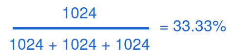

# ****

In part one of this series, I discussed the basic concepts of cgroups and how cgroups help to manage performance and security on Linux servers. Here in part two, I discuss the CPUShares value and how it is used by cgroups. Don't forget that in part three I look at cgroup administration and in part four I conclude with cgroups as they interact with systemd.

A little about Linux Elevators
I'm going to take a very narrow focus on Red Hat Enterprise Linux (RHEL) for this section. However, in my quick look at the few Ubuntu boxes in my lab, I noticed similarities with the I/O scheduler. Therefore, some of my points could apply to other distributions, as well. Most of the Red Hat family of products (Fedora, CentOS, and RHEL) use either deadline or cfq as the default schedulers.

- Completely Fair Queuing (CFQ): Emphasizes I/O coming from real-time processes and uses historical data to decide whether an application will issue more I/O requests in the near future.
- Deadline: Attempts to provide a guaranteed latency for requests and is particularly suitable when read operations occur more often than write operations. There is one queue for reads and one for writes. Operations are completed based on time spent in the queue, and the kernel will always try to process requests before their maximum amount of time has elapsed. Read operations take precedence over write batches by default.

With that in mind, RHEL tends to use cfq for SATA-based drives and deadline for all other cases by default. This plays an important role in tuning your system. These schedulers can be changed, of course, and you should investigate your workload and pick the scheduler that best suits your task(s). It is also worth noting that a scheduler can be chosen per block device. This means that you could have multiple schedulers on a single system, depending on how your disks are configured.

[ You might also like: Setting up containerized SSH servers for session recording with tlog ]

## CPUShares

The CPUShares value provides tasks in a cgroup with a relative amount of CPU time. Once the system has mounted the cpu cgroup controller, you can use the file cpu.shares to define the number of shares allocated to the cgroup. CPU time is determined by dividing the cgroup's CPUShares by the total number of defined CPUShares on the system. This CPU time math gets quite complicated, so let's look at some diagrams to clarify things.

The above diagram represents some of the most common elements on a RHEL 7 OpenShift Container Platform control plane server. Every process on this system starts with the / cgroup.

In RHEL, this begins with the root / cgroup with 1024 shares and 100% of CPU resources. The rest of the resources are divided equally amongst the groups /system.slice, /user.slice, and /kubepod.slice, each with an equal weight of 1024 by default, as seen below:

In this scenario, the logic is pretty straight forward: Each slice can use only 33% of the CPUShares if all cgroups are demanding shares simultaneously. The math is pretty simple:

And when you plug in the numbers:

However, what if you decided to nest groups or change the weight of groups at the same level? Below is an example of the nested groups:

In this example, you see that I have created a cgroup for different users. Here is where the math gets interesting. At first, you would think that the following equation would work just fine:

cgroup slices calculation, but with the wrong values

However, this is only 23% of the 33% allotted to the user.slice. That means user1 has approximately 7.6% of total CPU time based on these weights in the event of resource contention.

CPUShares just got complicated in a hurry. Thankfully, most of the other controllers are more straight forward than this one.

Wrap up
The CPUShares values can make cgroups seem really complex. That's part of why I wanted to cover CPUShares here. However, the proper use of CPUShares helps you manage your system more efficiently and accurately.

In the next article of this series, I discuss cgroup administration. I hope that you'll continue following this series. In part four I'll wrap up our discussion with systemd and cgroups.
